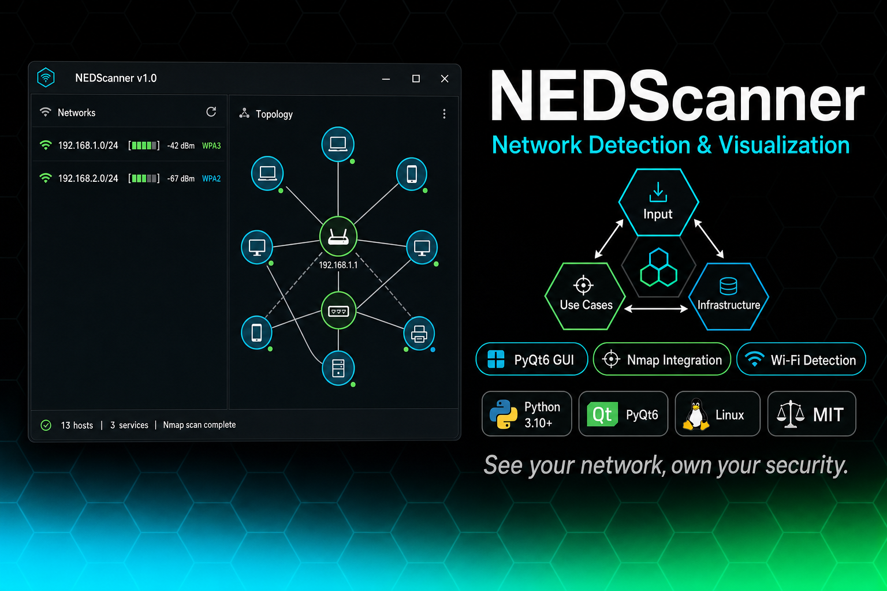

# NEDScanner

[](LICENSE)
[](https://python.org)
[](https://pypi.org/project/PyQt6/)
[](#)


**See your network, own your security.**

NEDScanner es una aplicación GUI desarrollada con PyQt6 para la detección y visualización de redes en sistemas Linux, siguiendo una arquitectura hexagonal que reutiliza herramientas existentes como Nmap, NetworkManager y Scapy.

## Características

- **Escaneo de redes Wi-Fi**: Detecta y muestra información detallada de redes inalámbricas.
- **Escaneo de red con Nmap**: Realiza escaneos de puertos y servicios en redes locales o remotas.
- **Descubrimiento rápido**: Utiliza técnicas ligeras (ARP, ICMP, mDNS) para encontrar dispositivos.
- **Historial y comparación**: Almacena resultados de escaneos para análisis y comparación.
- **Interfaz asíncrona**: No bloquea la UI durante operaciones de red intensivas.

## Requisitos

- Python 3.7+
- PyQt6
- NetworkManager (para funciones Wi-Fi)
- Nmap (para escaneo de puertos)
- Permisos adecuados (o capabilities) para operaciones de red

## Instalación

1. **Clonar el repositorio**:
   ```bash
   git clone <URL_DEL_REPOSITORIO>
   cd NEDScaner
   ```

2. **Crear y activar un entorno virtual** (opcional pero recomendado):
   ```bash
   python -m venv venv
   
   # En Windows
   .\venv\Scripts\activate
   
   # En Linux/macOS
   source venv/bin/activate
   ```

3. **Instalar dependencias**:
   ```bash
   pip install -r requirements.txt
   ```

4. **Configurar permisos** (solo Linux):
   
   Para ejecutar sin privilegios de root, configure capabilities:
   ```bash
   sudo setcap cap_net_raw,cap_net_admin+eip /usr/bin/python3
   sudo setcap cap_net_raw,cap_net_admin+eip /usr/bin/nmap
   ```
   
   O alternativamente, ejecute la aplicación con sudo (no recomendado para uso regular):
   ```bash
   sudo python main.py
   ```

## Uso

1. **Iniciar la aplicación**:
   ```bash
   python main.py
   ```

2. **Escaneo Wi-Fi**:
   - Seleccione la pestaña "Wi-Fi"
   - Elija la interfaz de red
   - Haga clic en "Escanear Redes Wi-Fi"

3. **Escaneo de Red (Nmap)**:
   - Seleccione la pestaña "Escaneo de Red"
   - Ingrese el objetivo (IP, rango, hostname)
   - Configure las opciones de escaneo
   - Haga clic en "Iniciar Escaneo"

4. **Descubrimiento Rápido**:
   - Seleccione la pestaña "Descubrimiento Rápido"
   - Ingrese el rango de red objetivo
   - Seleccione los métodos de descubrimiento
   - Haga clic en "Iniciar Descubrimiento"

5. **Ver Resultados**:
   - Seleccione la pestaña "Resultados"
   - Explore los escaneos anteriores
   - Compare resultados entre diferentes escaneos

## Estructura del Proyecto

- `app/`: Código principal de la aplicación
  - `ui/`: Componentes de la interfaz de usuario
  - `adapters/`: Adaptadores para herramientas externas (Nmap, nmcli, etc.)
  - `core/`: Lógica de negocio y orquestador
  - `models/`: Modelos de datos

## Configuración

La configuración se almacena en `~/.nedscaner/config.ini` y se puede modificar desde la pestaña "Configuración" de la aplicación.

## Resolución de Problemas

### Problemas de permisos

Si encuentra errores relacionados con permisos al escanear:

1. Verifique que las capabilities estén configuradas correctamente:
   ```bash
   getcap /usr/bin/python3
   getcap /usr/bin/nmap
   ```

2. Asegúrese de que su usuario tenga acceso a D-Bus para NetworkManager:
   ```bash
   ls -l /etc/polkit-1/rules.d/
   ```

### Problemas de dependencias

Si hay errores al iniciar la aplicación:

1. Verifique que todas las dependencias estén instaladas:
   ```bash
   pip install -r requirements.txt
   ```

2. Compruebe que Nmap esté instalado y accesible:
   ```bash
   which nmap
   nmap --version
   ```

## Contribuir

1. Fork el repositorio
2. Cree una rama para su función (`git checkout -b feature/amazing-feature`)
3. Commit sus cambios (`git commit -m 'Add some amazing feature'`)
4. Push a la rama (`git push origin feature/amazing-feature`)
5. Abra un Pull Request

## Licencia

Este proyecto está licenciado bajo [LICENCIA] - vea el archivo LICENSE para más detalles.
---

## Metodología

Desarrollado con [HCP (Human-Code-AI Protocol)](https://github.com/haletheia/human-code-ai-protocol) — protocolo git-native para Context Engineering.
